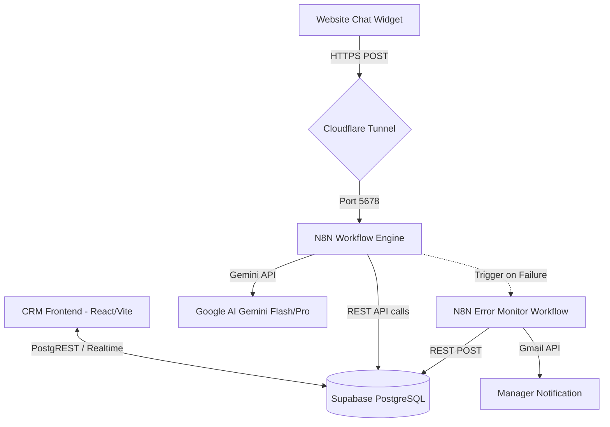

# 🚀 autoRI-studio CRM - תיעוד מלא מא' עד ת'

ברוך הבא לתיעוד הרשמי של מערכת ה-CRM של **autoRI-studio**. מסמך זה מספק סקירה מקיפה של ארכיטקטורת המערכת, מבנה הנתונים (Supabase), קוביות ה-N8N, מנגנון בקרת המכסות (Capping), ומדריך למשתמש ולמפתח.

---

## 📋 תוכן עניינים
1. [ארכיטקטורה וטכנולוגיות](#1-ארכיטקטורה-וטכנולוגיות)
2. [מבנה מסד הנתונים (Supabase Schema)](#2-מבנה-מסד-הנתונים-supabase-schema)
3. [פיצ'רים ומסכי המערכת](#3-פיצרים-ומסכי-המערכת)
4. [מנגנון הגבלת ריצות והחרגות (Quota Capping)](#4-מנגנון-הגבלת-ריצות-והחרגות-quota-capping)
5. [אינטגרציית N8N וזרימות עבודה (Workflows)](#5-אינטגרציית-n8n-וזרימות-עבודה-workflows)
6. [מנגנון דיאגנוסטיקה ופענוח סטטוסים (Diagnostics)](#6-מנגנון-דיאגנוסטיקה-ופענוח-סטטוסים-diagnostics)
7. [מדריך הרצה ופריסה (Deployment)](#7-מדריך-הרצה-ופריסה-deployment)

---

## 1. ארכיטקטורה וטכנולוגיות

מערכת ה-CRM בנויה בארכיטקטורת **Client-Server-Serverless** מודרנית:

*   **פרונטאנד (Frontend):** 
    *   **React** בשילוב **Vite** כסביבת פיתוח ובנייה מהירה במיוחד.
    *   עיצוב רספונסיבי מבוסס **Vanilla CSS** עם ערכת נושא כהה/חלקה יוקרתית (HSL variables).
    *   חבילת אייקונים מבית Lucide-react ו-FontAwesome.
*   **בסיס נתונים (Database Backend):**
    *   **Supabase (PostgreSQL)** כשירות מנוהל (Baas).
    *   אבטחת נתונים קשיחה באמצעות חוקי **Row Level Security (RLS)**.
    *   פונקציות מסד נתונים (RPC) ב-PL/pgSQL לחישובי מכסה בזמן אמת ותהליכי ריקון אוטומטיים (Rollups & Pruning).
*   **אוטומציה מאחורי הקלעים:**
    *   **N8N (Dockerized)** כשרת האוטומציות המרכזי.
    *   **Cloudflare Tunnels (cloudflared)** לחשיפת שרת ה-N8N בצורה מאובטחת לרשת האינטרנט החיצונית (תחת הדומיין `n8n.autori-studio.com`).



---

## 2. מבנה מסד הנתונים (Supabase Schema)

המערכת מנהלת שבע טבלאות ליבה וטבלת סטטיסטיקות יומית.

### א. טבלת לידים (`leads`)
מנהלת את הלקוחות הפוטנציאליים ואת שלבי המכירה.
*   `id` (UUID, PK)
*   `created_at` (Timestamp)
*   `name` (TEXT) - שם הליד/איש הקשר.
*   `company` (TEXT) - שם החברה.
*   `email` (TEXT), `phone` (TEXT)
*   `status` (TEXT) - סטטוס בלוח הקנבן: `new`, `contacted`, `in_progress`, `converted` (won), `lost`.
*   `value` (NUMERIC) - שווי עסקה מוערך.
*   `source` (TEXT) - מקור הליד (לדוגמה: "צ'אטבוט באתר").

### ב. טבלת משימות (`tasks`)
*   `id` (UUID, PK)
*   `lead_id` (UUID, FK -> `leads`)
*   `title` (TEXT), `completed` (BOOLEAN)
*   `due_date` (Timestamp)
*   `dependency_id` (UUID, FK -> `tasks`) - משימה חוסמת (לניהול גאנט/סדר ביצוע).

### ג. טבלת הערות (`notes`)
הערות פנימיות של אנשי המכירות על גבי כרטיס הליד.
*   `id` (UUID, PK)
*   `lead_id` (UUID, FK -> `leads`)
*   `content` (TEXT)

### ד. טבלת אוטומציות (`automations`)
הגדרות האוטומציה של הלקוחות וניהול החבילות.
*   `id` (UUID, PK)
*   `name` (TEXT) - שם האוטומציה.
*   `status` (TEXT) - מצב פעילות: `active`, `testing`, `inactive`.
*   `runs_goal` (INTEGER) - מכסת הריצות הבסיסית בחודש.
*   `extra_runs_allowance` (INTEGER) - בונוס ריצות מיוחד/זמני.
*   `block_on_limit` (BOOLEAN) - האם לחסום ריצות בחריגה (Capping) או לאפשר חיוב יתר (Overage).
*   `custom_overage_rate` (NUMERIC) - תעריף לכל ריצה עודפת בחריגה (ברירת מחדל: 0.05 ₪).
*   `n8n_workflow_id` (TEXT) - רשימת מזהי ה-workflows ב-N8N המיוחשים לאוטומציה (מופרדים בפסיק).

### ה. טבלת ריצות אוטומציה (`automation_runs`)
תיעוד פרטני של כל ריצה שבוצעה בפועל ב-N8N.
*   `id` (UUID, PK)
*   `created_at` (Timestamp)
*   `automation_id` (UUID, FK -> `automations`)
*   `n8n_workflow_id` (TEXT)
*   `status` (TEXT) - סטטוס הריצה: `success`, `fallback`, `error`.
*   `duration_ms` (INTEGER) - משך זמן הריצה במילישניות.
*   `error_type` (TEXT) - סוג השגיאה (במידה ונכשלה).
*   `details` (JSONB) - קלט/פלט מפורט של השיחה (הודעת משתמש ומענה הבוט).

### ו. טבלת התראות מערכת (`system_alerts`)
התראות חריגות, קריסות של הבוט או חסימות עקב הגבלת מכסה.
*   `id` (UUID, PK)
*   `created_at` (Timestamp)
*   `title` (TEXT), `message` (TEXT)
*   `type` (TEXT) - סוג ההתראה: `info`, `warning`, `error`.
*   `n8n_workflow_id` (TEXT)
*   `duration_ms` (INTEGER)

### ז. טבלת סטטיסטיקות יומית (`automation_daily_stats`)
סיכומים יומיים היסטוריים המשמשים להצגת גרפים ב-CRM לאחר מחיקת לוגים פרטניים (למניעת עומס במסד הנתונים).
*   `date` (DATE)
*   `automation_id` (UUID, FK)
*   `total_runs` (INTEGER)
*   `success_runs` (INTEGER), `warning_runs` (INTEGER), `error_runs` (INTEGER)
*   `avg_duration_ms` (INTEGER)
*   `error_types` (JSONB) - ריכוז סוגי השגיאות באותו יום.

---

## 3. פיצ'רים ומסכי המערכת

### א. לוח הבקרה (Dashboard)
*   **מדדי בריאות (KPIs):** מציג את סך הלידים, משימות פתוחות, באגים מדווחים, כמות התראות מערכת פעילות ואחוז ניצול המכסה.
*   **גרפי שימוש יומיים:** תצוגה ויזואלית של כמות הריצות לאורך החודש.
*   **התראות מערכת (System Alerts Panel):** מציג אזהרות וקריסות בזמן אמת עם אפשרות לסימון כנקרא.

### ב. לוח קנבן (Kanban Board)
*   מעקב חזותי מלא אחר מסע הלקוח (Pipeline).
*   אפשרות לגרור ולשחרר (Drag and Drop) כרטיסי לידים בין שלבים.
*   לחיצה על כרטיס פותחת את תיק הלקוח המלא.

### ג. ניהול אוטומציות ופרויקטים (Projects Tab)
*   **ניהול חבילות ומכסות:** הגדרת מכסת ריצות חודשית, הוספת בונוס ריצות מותאם וקביעת תעריפי חריגה.
*   **מפסק Capping:** כפתור למניעת חריגות (Block on Limit) - חסימה מיידית ב-N8N ברגע ההגעה למכסה.
*   **דוחות שימוש חודשיים:** מעקב אחר צפי סוף חודש, כמות הריצות העודפות ועלות חיוב היתר המצטברת.
*   **לוג ריצות טכני מפורט:** מעקב אחר ביצועי הצ'אטבוט ומערכת הניטור.
*   **מדדי בריאות לאוטומציה (Health Score):** ציון באחוזים המחושב על בסיס היחס בין הצלחות לשגיאות ב-30 הימים האחרונים (לא כולל ריצות שנחסמו במתכוון).

### ד. כרטיס לקוח מורחב (LeadDetailsModal)
*   **פרטי ליד:** שם, טלפון, אימייל ומקור ההגעה.
*   **ניהול משימות חכמות (Gantt-like Dependency):** סימון משימות כהושלמו. המערכת מונעת סימון משימה כהושלמה אם יש משימה קודמת שחוסמת אותה (`dependency_id`).
*   **ניהול קבצים ומסמכים:** העלאת הצעות מחיר, חוזים וטפסים ישירות ל-Supabase Storage.
*   **היסטוריית שיחות הצ'אטבוט:** תצוגת לוג מפורטת של השיחה שניהל הליד מול Gemini (הקלט של הליד והמענה של הבוט).

### ה. מחשבון תמחור ו-ROI משודרג (PricingCalculator)
*   **בורר סוגי פרויקטים:** מעבר מהיר בין תמחור אוטומציות ו-AI לבין בניית אתרי אינטרנט לעסקים.
*   **תמחור אתרים מותאם:** חישוב על בסיס סוגי אתרים (דפי נחיתה, תדמית, איקומרס, פורטל), רכיבים ותוספות אינטראקטיביים (צ'אטבוט Gemini, מחשבון, שאלון, חיבור ל-CRM) וחבילות תחזוקה ואחסון (SLA).
*   **הערכת ROI והחזר השקעה:** חישוב חיסכון חודשי ישיר בהתבסס על עלות שעת עובד ושעות עבודה ידניות שנחסכות.
*   **ייצוא והעתקה:** העתקת הצעת מחיר מפורמטת בעברית עסקית מהודרת לשליחה מהירה בווטסאפ או במייל, ושמירתה בכרטיס הליד.

---

## 4. מנגנון הגבלת ריצות והחרגות (Quota Capping)

בקרת הריצות מתבצעת בצורה היברידית על מנת לשלב בין ביצועים מהירים לדיוק נתונים:

### א. פונקציית Quota Check ב-Supabase (`check_automation_quota`)
בכל פעם שהצ'אטבוט מופעל, הוא קורא לפונקציית ה-RPC של Supabase. הפונקציה מבצעת את הפעולות הבאות:
1.  שולפת את ההגדרות של האוטומציה (`runs_goal`, `extra_runs_allowance`, `block_on_limit`).
2.  מחשבת את המכסה המותרת הכוללת: `runs_limit = runs_goal + extra_runs_allowance`.
3.  סופרת את הריצות של החודש הנוכחי. כדי למנוע כפילויות ספירה ולשמור על ביצועים:
    *   נספרות הריצות המפורטות ב-7 הימים האחרונים מטבלת `automation_runs`.
    *   נספרות הריצות ההיסטוריות מתחילת החודש ועד לפני 7 ימים מתוך טבלת הסיכום `automation_daily_stats`.
    *   **סינון ריצות חסומות:** ריצות שנחסמו עקב חריגה מהמכסה מוחרגות מהספירה על מנת לא "לאכול" את המכסה של הלקוח.
4.  החלטה:
    *   אם `runs_count < runs_limit` -> מאושר (`allowed = true`).
    *   אם הלקוח הגיע למכסה, אך מוגדר כ-VIP (`block_on_limit = false`) -> מאושר (`allowed = true`) עם סימון לחיוב חריגה.
    *   אחרת -> חסימה (`allowed = false`).

### ב. תהליך ריקון וארכוב אוטומטי (Rollup & Pruning)
על מנת למנוע צבירת מיליוני שורות בטבלת הריצות ופגיעה בביצועי מסד הנתונים, מופעל תהליך אוטומטי מתוזמן (Cron Job) ב-Supabase המריץ את הפונקציה `public.aggregate_and_purge_runs` מדי לילה בשעה 00:05:
1.  הפונקציה מסכמת את כל הריצות וההתראות של היום הקודם ומאחדת אותן לשורה בודדת בטבלת `automation_daily_stats`.
2.  היא שומרת את התפלגות הריצות לפי שעות (מערך בגודל 24 שעות) ואת התפלגות סוגי השגיאות והאזהרות כ-JSONB.
3.  מבוצע ניקוי (Purge) של שורות פיזיות ישנות:
    *   ריצות מוצלחות ואזהרות (התראות `info`/`warning`) היסטוריות נמחקות לאחר **7 ימים**.
    *   ריצות שנכשלו (סטטוס `error`) נשמרות לדיבוג ונמחקות לאחר **30 ימים**.

---

## 5. אינטגרציית N8N וזרימות עבודה (Workflows)

אוטומציית הבוט מנוהלת באמצעות שני Workflows מרכזיים ב-N8N:

### א. צ'אטבוט האתר (`lyCrWBmsGlRSMJmo`)
מנהל את השיחה האינטראקטיבית מול הלקוח ומבצע את החסימה במידת הצורך.

1.  **טריגר כניסה (Webhook):** מקבל קריאות POST מהאתר עם הודעת הלקוח והיסטוריית השיחה.
2.  **שלב בדיקת מכסה (Check Quota):** מבצע פניית HTTP POST ל-Supabase RPC לקריאה לפונקציה `check_automation_quota`.
3.  **פיצול תנאי (Quota Allowed?):**
    *   **מסלול False (נחסם):**
        *   קורא לקוביית `Log Blocked Run` כדי לתעד את ניסיון החסימה בטבלת `system_alerts` (סוג `error`, כותרת `❌ צ'אטבוט: הרצה נחסמה (חריגה ממכסה)`).
        *   מחזיר מענה חסימה מיידי לגולש (בתוך 0.8 שניות) ומסיים את ההרצה.
    *   **מסלול True (מאושר):**
        *   פונה למודל הראשי **Gemini Flash** עם היסטוריית השיחה והוראות מערכת קשיחות להחזרת JSON תקין הכולל הודעה, כפתורים (chips) ופרטי ליד.
        *   **מנגנון זיהוי כשלים (Fallback):** לקוביית Gemini Flash מוגדרת הגדרת כשל `onError = continueErrorOutput`.
        *   במידה ו-Gemini Flash נכשל (API Down, Timeout או מגבלת ריצות של גוגל):
            *   הזרימה עוברת לקוביית הגיבוי **Gemini Pro**.
            *   נשלח מענה הגיבוי לגולש.
            *   מבוצע רישום ב-`automation_runs` עם סטטוס `fallback`.
            *   נרשמת התראת מערכת ב-`system_alerts` (סוג `warning`, כותרת `⚠️ צ'אטבוט: גיבוי Gemini Pro`).
        *   במידה ו-Gemini Flash הצליח:
            *   נשלח מענה מהיר לגולש.
            *   מבוצע רישום ב-`automation_runs` עם סטטוס `success`.
            *   נרשמת התראה ב-`system_alerts` (סוג `info`, כותרת `✅ צ'אטבוט: מענה Gemini Flash`).

> [!IMPORTANT]
> **מניעת שגיאות טיפוסים ב-N8N:** כל קוביות רישום הלוגים ל-Supabase מוגדרות בפורמט אובייקט JavaScript (`jsonBody` מתחיל ב-`={{` ומכיל `{ ... }`). זה מונע מ-N8N להקיף את ערך ה-`duration_ms` בגרשיים, דבר שהיה גורם לקריסה ב-Postgres עקב בעיית טיפוסי נתונים.

### ב. מנטר השגיאות הכללי (`bRNz7Lq79wYJ5Dvo`)
מוגדר כ-`errorWorkflow` הרשמי בהגדרות של הצ'אטבוט. 
*   במידה וקובייה כלשהי בזרימה של הצ'אטבוט קורסת (למשל בעיית רשת מול Supabase או שגיאת פירסור לא צפויה):
    1.  מנטר השגיאות מופעל אוטומטית על ידי N8N.
    2.  הוא שולח מייל התראה מפורט ומעוצב לכתובת המנהל (`iraoutomations@gmail.com`) באמצעות Gmail API עם קישור ישיר לריצה שנכשלה ב-N8N.
    3.  הוא מתעד את השגיאה בטבלת `system_alerts` תחת קוביית `Log to Supabase` עם פרטי השגיאה המדויקים שגרמו לקריסה.

---

## 6. מנגנון דיאגנוסטיקה ופענוח סטטוסים (Diagnostics)

ה-CRM כולל מפענח שגיאות קליינט-סייד מלא המציג דיאגנוסטיקה מותאמת לכל ריצה לפי הסטטוס שלה:

| סטטוס ריצה | צבע ב-CRM | מקור הנתון | דיאגנוסטיקה והנחיות לפתרון |
| :--- | :--- | :--- | :--- |
| **Success** | ירוק 🟢 | `automation_runs` / `system_alerts` | **תקין:** הריצה הושלמה ללא שגיאות. כל הפעולות בוצעו בהצלחה. |
| **Fallback** / **Warning** | כתום 🟠 | `automation_runs` / `system_alerts` | **אזהרה (גיבוי פעיל):** המענה לגולש נשלח בהצלחה, אך המערכת נאלצה להשתמש במודל הגיבוי (Gemini Pro) עקב כשל במודל הראשי. מומלץ לוודא זמינות מפתח Gemini Flash. |
| **Blocked** | סגול 🟣 | `system_alerts` (כותרת מכילה "נחסמה") | **נחסם במתכוון:** המערכת חסמה את הריצה כדי למנוע חריגת תקציב של הלקוח. המשתמש קיבל הודעת חסימה מוגדרת מראש. |
| **Error** | אדום 🔴 | `automation_runs` / `system_alerts` | **שגיאת מערכת:** הריצה נכשלה במהלך הביצוע (קריסת קובייה). המערכת מציגה את שם הקובייה הספציפית שקרסה, תיאור השגיאה הטכנית ושלבי פתרון מומלצים. |

---

## 7. מדריך הרצה ופריסה (Deployment)

### א. הרצת הפרונטאנד (CRM)
1.  נווט לתיקיית ה-CRM:
    ```bash
    cd crm
    ```
2.  התקן תלויות (אם טרם הותקנו):
    ```bash
    npm install
    ```
3.  הרץ את שרת הפיתוח המקומי:
    ```bash
    npm run dev
    ```
4.  לבניית גרסת פרודקשן (Production Build):
    ```bash
    npm run build
    ```

### ב. סנכרון ופריסת וורקפלוז ל-N8N
המערכת כוללת תשתית פריסה אוטומטית מבוססת API של N8N. במידה וביצעת שינויים בקבצי ה-JSON של ה-Workflows בתיקיית הפרויקט:
1.  ודא ששרת ה-N8N המקומי שלך פעיל (רץ בתוך ה-Docker container).
2.  הרץ את סקריפט הפריסה האוטומטי:
    ```bash
    python scratch/deploy_local_workflows.py
    ```
    הסקריפט יטען את הגדרות ה-JSON המעודכנות, יבצע בדיקות תקינות מובנות ללוגיקת התנאים, ויעדכן ויפעיל (Activate) את ה-Workflows בשרת ה-Live באופן אוטומטי.

### ג. הרצת בדיקות אינטגרציה מקומיות
קיימים סקריפטים מובנים בתיקיית `scratch` לביצוע בדיקות אינטגרציה מקומיות מהירות ללא צורך בממשק משתמש:
*   **בדיקת נתיב הצלחה / גיבוי:** `python scratch/test_chatbot_webhook.py` - שולח הודעה לבוט ומדפיס את התשובה והצ'יפים שהתקבלו.
*   **בדיקת נתיב חסימת מכסה:** `python scratch/test_quota_block.py` - מדמה הגעה למכסה וחוסם זמנית את הבוט כדי לוודא זיהוי חסימה.

---
*נכתב באהבה על ידי צוות הפיתוח של autoRI-studio 🚀*
